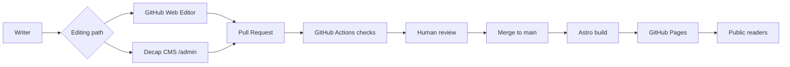

# Platform Design

## Goal

Create a neutral public knowledge base where support writers can publish best practices, FAQs, and troubleshooting notes without exposing internal company context.

## Recommended architecture

## Publishing model

GitHub is enough for the first version:

- GitHub stores content.
- GitHub pull requests provide review.
- GitHub Actions runs sensitive-term checks and build checks.
- GitHub Pages hosts the static site.

No application server is required for readers.

## Writer UX choices

### GitHub-only writer flow

Use this first. It is simpler and works immediately after repository setup.

Pros:

- No server.
- No extra OAuth service.
- Strong review and audit trail.
- Easy rollback.

Cons:

- Writers must learn basic Markdown and GitHub pull requests.

### CMS writer flow

Use this after the first content team pilot if GitHub editing feels too technical.

Pros:

- Friendlier editor.
- Structured fields.
- Editorial workflow.

Cons:

- Needs GitHub auth support for Decap CMS.
- Requires either Netlify Identity/Git Gateway or a small OAuth backend.

## GitHub Actions design

Pull requests:

- Install dependencies.
- Run content policy scan.
- Build the site.
- Block merge if checks fail.

Push to `main`:

- Run the same checks.
- Build static output.
- Deploy to GitHub Pages.

## Future AI features

Add these after content and search are stable:

- AI draft reviewer that checks neutrality, official-source grounding, and sensitive terms.
- AI answer assistant over approved published docs.
- Stale-content detector that asks for review when official docs change.
- Search analytics and unanswered-question capture.
